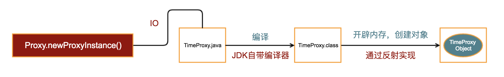
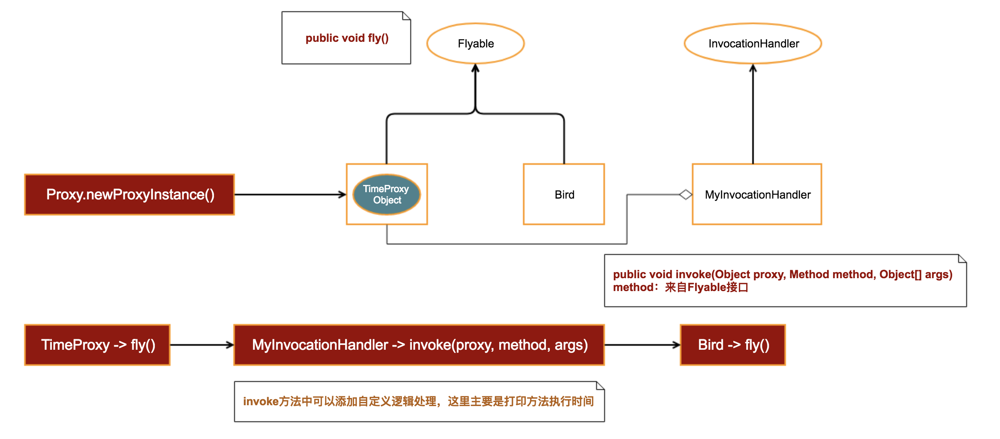

# [10分钟看懂动态代理设计模式](https://blog.csdn.net/u014589856/article/details/79551155?from=timeline&isappinstalled=0)

# 1. 静态代理

## 一个简单的例子

```java
public interface Flyable {
    void fly();
}
 
public class Bird implements Flyable {
 
    @Override
    public void fly() {
        System.out.println(Bird2);
        try {
            Thread.sleep(new Random().nextInt(1000));
        } catch (InterruptedException e) {
            e.printStackTrace();
        }
    }
}
```

## 如果我要知道小鸟在天空中飞行了多久，怎么办？

```java
   @Override
    public void fly() {
        long start = System.currentTimeMillis();
        System.out.println("Bird is flying...");
        try {
            Thread.sleep(new Random().nextInt(1000));
        } catch (InterruptedException e) {
            e.printStackTrace();
        }
        long end = System.currentTimeMillis();
        System.out.println("Fly time = " + (end - start));
    }
```

## 如果Bird这个类来自于某个SDK（或者说Jar包）提供，你无法改动源码，怎么办？

```java
public static void main(String[] args) {
        Bird bird = new Bird();
        long start = System.currentTimeMillis();
        bird.fly();
        long end = System.currentTimeMillis();
        System.out.println("Fly time = " + (end - start));
}
```

这个方案看起来似乎没有问题，但其实你忽略了准备这些方法所需要的时间，执行一个方法，需要开辟栈内存、压栈、出栈等操作，这部分时间也是不可以忽略的。因此，这个解决方案不可行。那么，还有什么方法可以做到呢？

## 1.1 使用继承

```java
public class Bird2 extends Bird {
 
    @Override
    public void fly() {
        long start = System.currentTimeMillis();
        
        super.fly();
        
        long end = System.currentTimeMillis();
        System.out.println("Fly time = " + (end - start));
    }
}
```

## 1.2 使用聚合

```java
public class Bird3 implements Flyable {
    private Bird bird;
 
    public Bird3(Bird bird) {
        this.bird = bird;
    }
 
    @Override
    public void fly() {
        long start = System.currentTimeMillis();
 
        bird.fly();
 
        long end = System.currentTimeMillis();
        System.out.println("Fly time = " + (end - start));
    }
}
```

继续深入思考，用问题推导来解答这个问题：

**问题一**：如果我还需要在fly方法前后打印日志，记录飞行开始和飞行结束，怎么办？
 有人说，很简单！继承Bird2并在在前后添加打印语句即可。那么，问题来了，请看问题二。

**问题二**：如果我需要调换执行顺序，先打印日志，再获取飞行时间，怎么办？
 有人说，再新建一个类Bird4继承Bird，打印日志。再新建一个类Bird5继承Bird4，获取方法执行时间。

## 1.3 聚合改进

```java
public class FlyableTimeProxy implements Flyable{
    private Flyable flyable;
    public FlyableTimeProxy(Flyable flyable){
        this.flyable = flyable;
    }
    
    @Override
    public void fly() {
        System.out.println("start log time");
        long start = System.currentTimeMillis();
        flyable.fly();
        long end = System.currentTimeMillis();
        System.out.println("end log time, " + this.getClass().getSimpleName() + " Flyable fly time is " + (end - start));
    }
}
```

```java
public class FlyableLogProxy implements Flyable{
    private Flyable flyable;
    public FlyableLogProxy(Flyable flyable){
        this.flyable = flyable;
    }
    
    @Override
    public void fly() {
        System.out.println("start fly");
        flyable.fly();
        System.out.println("end fly");
    }
}
```

接下来神奇的事情发生了，如果我们需要先记录日志，再获取飞行时间，可以在调用的地方这么做：

```java
// Log then time
Bird birdJack = new Bird("Jack");
FlyableLogProxy flyableLogProxy2 = new FlyableLogProxy(birdJack);
FlyableTimeProxy flyableTimeProxy2 = new FlyableTimeProxy(flyableLogProxy2);
flyableTimeProxy2.fly();
```

反过来，可以这么做：

```java
// Time then log
Bird birdTommy = new Bird("Tommy");
FlyableTimeProxy flyableTimeProxy = new FlyableTimeProxy(birdTommy);
FlyableLogProxy flyableLogProxy = new FlyableLogProxy(flyableTimeProxy);
flyableLogProxy.fly();
```

使用聚合能灵活代理目标类/方法

---

# 2. 动态代理



## 第一步：生成TimeProxy源码

```java
public class Proxy {

    public static Object newProxyInstance() throws IOException {
        TypeSpec.Builder typeSpecBuilder = TypeSpec.classBuilder("TimeProxy")
            .addSuperinterface(Flyable.class);

        FieldSpec fieldSpec = FieldSpec.builder(Flyable.class, "flyable", Modifier.PRIVATE).build();
        typeSpecBuilder.addField(fieldSpec);

        MethodSpec constructorMethodSpec = MethodSpec.constructorBuilder()
                .addModifiers(Modifier.PUBLIC)
                .addParameter(Flyable.class, "flyable")
                .addStatement("this.flyable = flyable")
                .build();
        typeSpecBuilder.addMethod(constructorMethodSpec);

        Method[] methods = Flyable.class.getDeclaredMethods();
        for (Method method : methods) {
            MethodSpec methodSpec = MethodSpec.methodBuilder(method.getName())
                    .addModifiers(Modifier.PUBLIC)
                    .addAnnotation(Override.class)
                    .returns(method.getReturnType())
                    .addStatement("long start = $T.currentTimeMillis()", System.class)
                    .addCode("\n")
                    .addStatement("this.flyable." + method.getName() + "()")
                    .addCode("\n")
                    .addStatement("long end = $T.currentTimeMillis()", System.class)
                    .addStatement("$T.out.println(\"Fly Time =\" + (end - start))", System.class)
                    .build();
            typeSpecBuilder.addMethod(methodSpec);
        }

        JavaFile javaFile = JavaFile.builder("com.youngfeng.proxy", typeSpecBuilder.build()).build();
        // 为了看的更清楚，我将源码文件生成到桌面
        javaFile.writeTo(new File("/Users/ouyangfeng/Desktop/"));

        return null;
    }

}
```

在main方法中调用Proxy.newProxyInstance()，你将看到桌面已经生成了TimeProxy.java文件，生成的内容如下：

```java
package com.youngfeng.proxy;

import java.lang.Override;
import java.lang.System;

class TimeProxy implements Flyable {
  private Flyable flyable;

  public TimeProxy(Flyable flyable) {
    this.flyable = flyable;
  }

  @Override
  public void fly() {
    long start = System.currentTimeMillis();

    this.flyable.fly();

    long end = System.currentTimeMillis();
    System.out.println("Fly Time =" + (end - start));
  }
}
```

## 第二步：编译TimeProxy源码

编译TimeProxy源码我们直接使用JDK提供的编译工具即可，为了使你看起来更清晰，我使用一个新的辅助类来完成编译操作：

```java
public class JavaCompiler {

    public static void compile(File javaFile) throws IOException {
        javax.tools.JavaCompiler javaCompiler = ToolProvider.getSystemJavaCompiler();
        StandardJavaFileManager fileManager = javaCompiler.getStandardFileManager(null, null, null);
        Iterable iterable = fileManager.getJavaFileObjects(javaFile);
        javax.tools.JavaCompiler.CompilationTask task = javaCompiler.getTask(null, fileManager, null, null, null, iterable);
        task.call();
        fileManager.close();
    }
}
```

在Proxy->newProxyInstance()方法中调用该方法，编译顺利完成：

```java
// 为了看的更清楚，我将源码文件生成到桌面
String sourcePath = "/Users/ouyangfeng/Desktop/";
javaFile.writeTo(new File(sourcePath));

// 编译
JavaCompiler.compile(new File(sourcePath + "/com/youngfeng/proxy/TimeProxy.java"));
```

## 第三步：加载到内存中并创建对象

```java
  URL[] urls = new URL[] {new URL("file:/" + sourcePath)};
  URLClassLoader classLoader = new URLClassLoader(urls);
  Class clazz = classLoader.loadClass("com.youngfeng.proxy.TimeProxy");
  Constructor constructor = clazz.getConstructor(Flyable.class);
  Flyable flyable = (Flyable) constructor.newInstance(new Bird());
  flyable.fly();
```

通过以上三个步骤，我们至少解决了下面两个问题：

- 不再需要手动创建TimeProxy
- 可以代理任意实现了Flyable接口的类对象，并获取接口方法的执行时间

可是，说好的任意对象呢？

## 第四步：增加InvocationHandler接口

为了增加控制的灵活性，我们考虑针将代理的处理逻辑也抽离出来（这里的处理就是打印方法的执行时间）。新增`InvocationHandler`接口，用于处理自定义逻辑：

```java
public interface InvocationHandler {
    void invoke(Object proxy, Method method, Object[] args);
}
```

- proxy => 这个参数指定动态生成的代理类，这里是`TimeProxy`
- method => 这个参数表示传入接口中的所有Method对象
- args => 这个参数对应当前method方法中的参数

MyInvocationHandler.java

```java
public class MyInvocationHandler implements InvocationHandler {
    private Bird bird;

    public MyInvocationHandler(Bird bird) {
        this.bird = bird;
    }

    @Override
    public void invoke(Object proxy, Method method, Object[] args) {
        long start = System.currentTimeMillis();

        try {
            method.invoke(bird, new Object[] {});
        } catch (IllegalAccessException e) {
            e.printStackTrace();
        } catch (InvocationTargetException e) {
            e.printStackTrace();
        }

        long end = System.currentTimeMillis();
        System.out.println("Fly time = " + (end - start));
    }
}
```

查看Proxy->newProxyInstance()的源码，代理类继承的接口我们是写死的，为了增加灵活性，我们将接口类型作为参数传入：

Proxy.java

```java
 public static Object newProxyInstance(Class inf, InvocationHandler handler) throws Exception {
        TypeSpec.Builder typeSpecBuilder = TypeSpec.classBuilder("TimeProxy")
                .addModifiers(Modifier.PUBLIC)
                .addSuperinterface(inf);

        FieldSpec fieldSpec = FieldSpec.builder(InvocationHandler.class, "handler", Modifier.PRIVATE).build();
        typeSpecBuilder.addField(fieldSpec);

        MethodSpec constructorMethodSpec = MethodSpec.constructorBuilder()
                .addModifiers(Modifier.PUBLIC)
                .addParameter(InvocationHandler.class, "handler")
                .addStatement("this.handler = handler")
                .build();

        typeSpecBuilder.addMethod(constructorMethodSpec);

        Method[] methods = inf.getDeclaredMethods();
        for (Method method : methods) {
            MethodSpec methodSpec = MethodSpec.methodBuilder(method.getName())
                    .addModifiers(Modifier.PUBLIC)
                    .addAnnotation(Override.class)
                    .returns(method.getReturnType())
                    .addCode("try {\n")
                    .addStatement("\t$T method = " + inf.getName() + ".class.getMethod(\"" + method.getName() + "\")", Method.class)
                    // 为了简单起见，这里参数直接写死为空
                    .addStatement("\tthis.handler.invoke(this, method, null)")
                    .addCode("} catch(Exception e) {\n")
                    .addCode("\te.printStackTrace();\n")
                    .addCode("}\n")
                    .build();
            typeSpecBuilder.addMethod(methodSpec);
        }

        JavaFile javaFile = JavaFile.builder("com.youngfeng.proxy", typeSpecBuilder.build()).build();
        // 为了看的更清楚，我将源码文件生成到桌面
        String sourcePath = "/Users/ouyangfeng/Desktop/";
        javaFile.writeTo(new File(sourcePath));

        // 编译
        JavaCompiler.compile(new File(sourcePath + "/com/youngfeng/proxy/TimeProxy.java"));

        // 使用反射load到内存
        URL[] urls = new URL[] {new URL("file:" + sourcePath)};
        URLClassLoader classLoader = new URLClassLoader(urls);
        Class clazz = classLoader.loadClass("com.youngfeng.proxy.TimeProxy");
        Constructor constructor = clazz.getConstructor(InvocationHandler.class);
        Object obj = constructor.newInstance(handler);

        return obj;
 }
```

测试代码

```java
Proxy.newProxyInstance(Flyable.class, new MyInvocationHandler(new Bird()));
```

生成的TimeProxy.java源码

```java
package com.youngfeng.proxy;

import java.lang.Override;
import java.lang.reflect.Method;

public class TimeProxy implements Flyable {
  private InvocationHandler handler;

  public TimeProxy(InvocationHandler handler) {
    this.handler = handler;
  }

  @Override
  public void fly() {
    try {
        Method method = com.youngfeng.proxy.Flyable.class.getMethod("fly");
        this.handler.invoke(this, method, null);
    } catch(Exception e) {
        e.printStackTrace();
    }
  }
}
```

至此，整个方法栈的调用栈变成了这样：



